### IFB452 group 17 Assessment 3
public repository link: https://github.com/anhduongnguyen/IFB452_Group17_BlockchainProject.git
<br />

# TimeBlock Blockchain App 
## 1. Project Overview

* **Purpose:** TimeBlock is a blockchain-based platform designed to allow users to track the authenticity, manufacturing history, ownership, and resale of luxury watches.


* **Motivation:** With over 40 million counterfeit watches sold annually, trust is a major issue in the secondary watch market. TimeBlock provides a decentralised, tamper-proof solution for verifying watch authenticity and ownership, replacing outdated and forgeable paper documentation.
* **Intended Users:** Manufacturers, Retailers, Buyers, Resellers.
* **Blockchain Integration:**  Uses smart contracts to facilitate watch registration, verification, ownership transfer, listing, and secure payment via escrow.
## 2. Key Features

* **Role-based Dashboards:** Tailored dashboards for each user role showing only relevant actions and data.
* **Certificate Viewing:** Certificates created by manufacturers include model, serial number, manufacturer, production date, and ownership.
* **Price Setting & Listings:**  Retailers and customers can list watches for sale with a custom price in ETH.
* **Fund Deposit & Release:** Transaction contract holds buyer funds securely until ownership is confirmed.
* **Ownership Transfer:** Transfers are managed by the Management contract, from initial assignment to final resale.
* **Transaction History:** Users can view a log of all significant watch-related events, ensuring transparency.

## 3. Tech Stack

* **Frontend:** HTML, CSS, JavaScript
* **Blockchain:** Solidity
* **Libraries:** Ethers.js
* **Tools:** MetaMask, Remix IDE, lite-server
* **Deployment** localhost

## 4. Folder Structure

```
├── contracts/                   # Smart contracts
│   ├── ManagementContract.sol   # Manages ownership & authenticity
│   ├── RegistrationContract.sol # Registers and stores watch details
│   └── TransactionContract.sol  # Handles listing, buying, escrow
├── TimeBlockApp/                # Frontend application
│   ├── node_modules/            # Project dependencies
│   ├── static/                  # Static assets (CSS, ABIs, Images, contract addresses)
│   │   ├── style.css
│   │   ├── ABI.js
|   |   ├── addresses.js         
│   │   └── img/
│   ├── customer.html            # Buyer interface (buy and sell)
│   ├── home.html                # Dashboard selector
│   ├── index.html               # Landing page
│   ├── manufacturer.html        # Manufacturer dashboard
│   ├── retailer.html            # Retailer dashboard
│   ├── reseller.html            # Reseller dashboard
│   ├── package.json
│   └── package-lock.json
└── README.md                    # Project overview and setup
```

## 5. Getting Started

### Prerequisites

* Install Node.js and npm
```
 https://nodejs.org/en
```
```
 https://www.npmjs.com/
```

* Install lite-server by typing this in your command prompt/terminal:
```
    npm install -g lite-server
```

* Install the MetaMask extension for google chrome and follow the steps to create an account
``` 
    https://metamask.io/
```
<br />

### Setup Test Network

* Click on the MetaMask extension and login using your registered details. Your landing page should look like this:

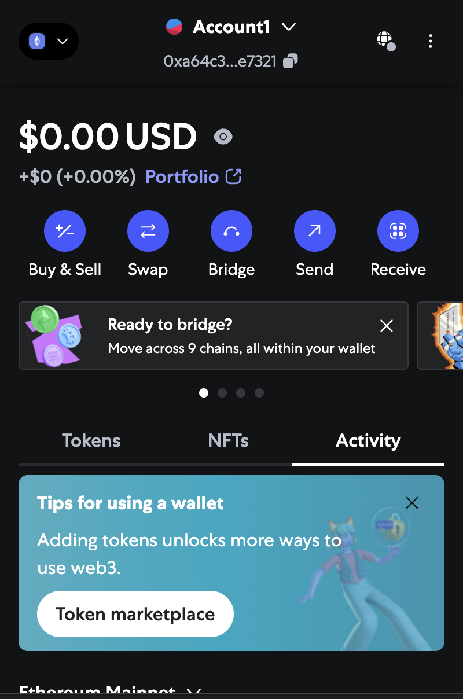


1. click the network dropdown (the button on the top right in screenshot above)
2. Click network dropdown → Enable "Show test networks"
3. Search up "Sepolia" and click the first option

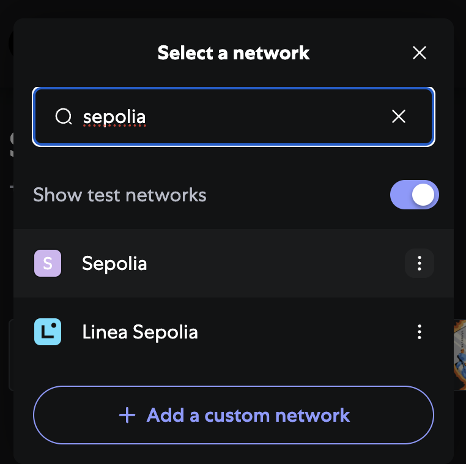


* Once connected, you will need to have ETH added to your wallet. go to a faucet website e.g

This website is for requesting a set amount of 0.05 sepolia ETH
```
 https://cloud.google.com/application/web3/faucet/ethereum/sepolia
```

This website is for mining sepolia ETH
```
 https://sepolia-faucet.pk910.de/#/
```
1. Copy your wallet from Metamask
2. paste it into the websites accordingly and run accordingly.
3. You will receive sepoliaETH, and it will appear in your account.

 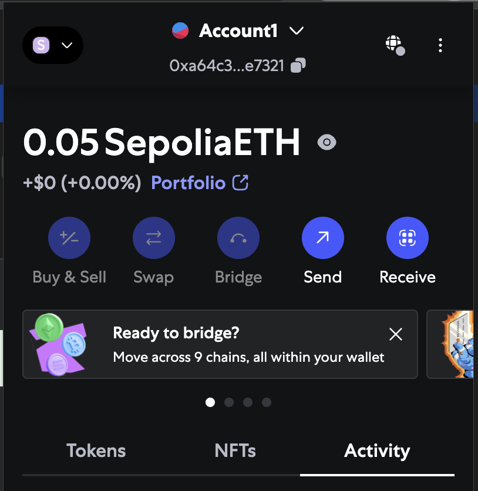


<br />

### Cloning the Repository 

To clone the project, open up the Remix IDE app on your desktop. 

1. Click on the git button on the left hand menu, then click the clone a git repository button.

 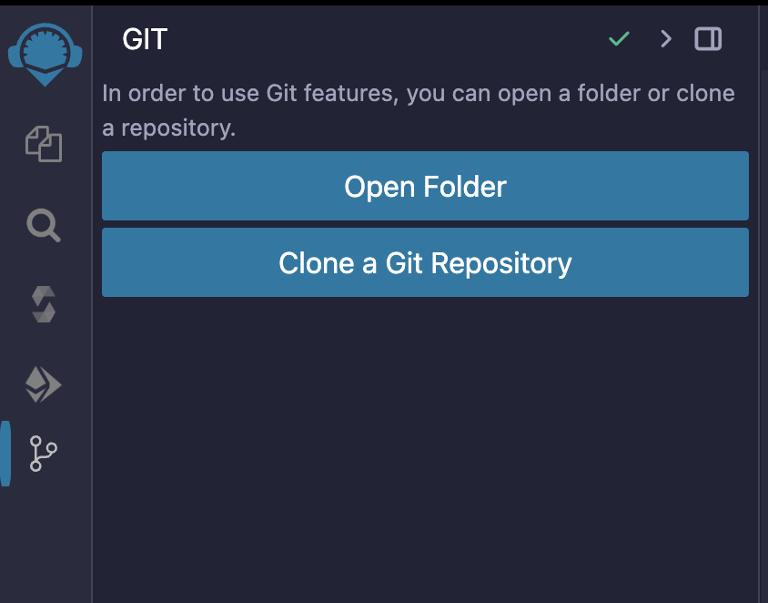

2. Paste this link into the text box.
```bash
    https://github.com/anhduongnguyen/IFB452_Group17_BlockchainProject.git
```
2. You will be prompted to select a repository destination on your desktop


## 6. Smart Contract Deployment

### Compile and Deploy

1. Visit the online remix IDE 
```
 https://remix-project.org/?lang=en
```
2. You will land on the online editor that looks exactly like the local desktop app. Here, you can choose to clone the repository or upload the folder project previously cloned. In this example I uploaded the project folder:

 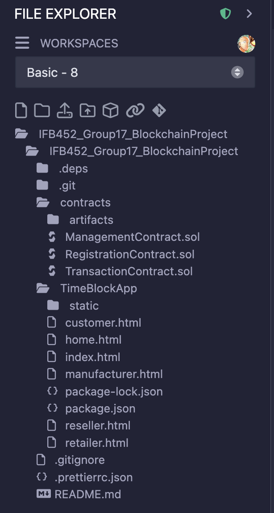


### Update ABI.js

1) for earch of the 3 contracts, you will need to compile it, and copy paste it's ABI into ABI.js. Make sure when copy pasting the ManagementContract.sol and TransactionContract.sol, you change the contract selection to use the actual contracts and not the interface of another contract declared. This is an example for RegistrationContract.sol:

 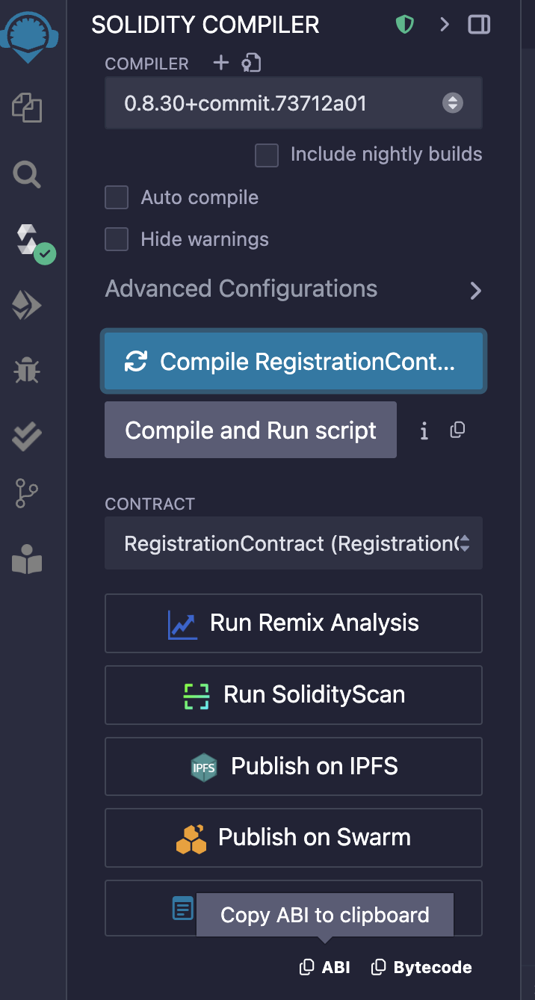

2. Copy paste ABI for the all contracts into ABI.js in the LOCAL REMIX IDE PROJECT

### Deploying Contracts using MetaMask

1. on the online Remix IDE click on the "Deploy & Run transactions" on the left hand menu. Make sure you connect your MetaMask account and select the environment as "Injected Provider - Metamask". Then, click deploy to deploy the contract. This is how it should look like:

 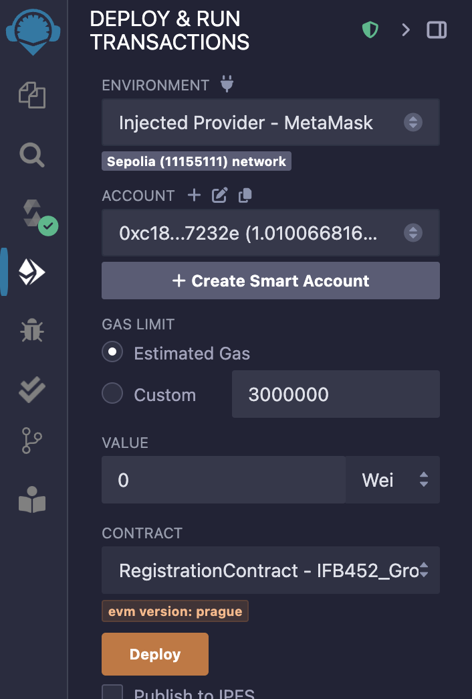

 2. After deployment, the contract will appear in the "Deployed Contracts" section. Copy the contract address and paste it into the addresses.js file in your LOCAL REMIX IDE PROJECT

 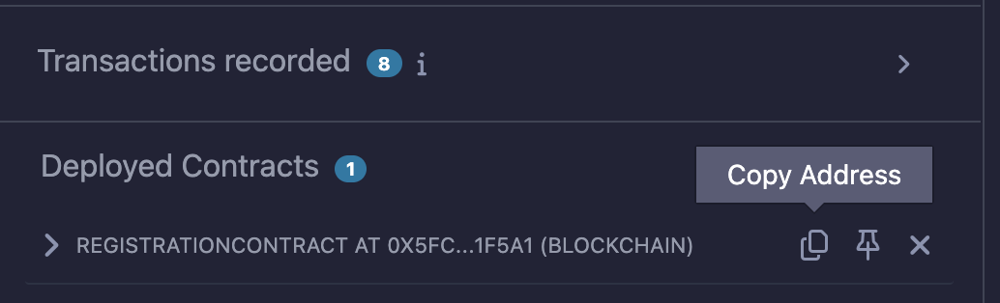

3. Repeat the same for ManagementContract.sol and TransactionContract.sol. 

## 7. Running the App

### Open in Browser (starting server)

1. Open up the project folder in your file explorer (windows) or Finder (MacOS)

4. Right click on the "TimeBlockApp" folder and select "New terminal Tab at Folder" and it will automatically open up the terminal/command prompt.

 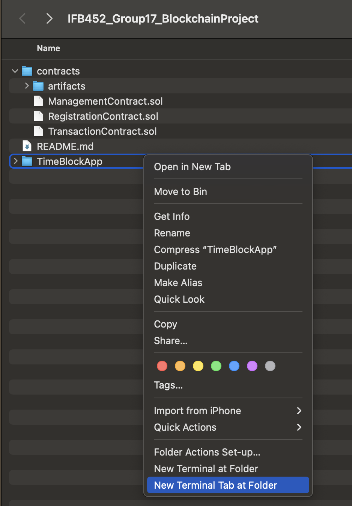

 5. Write the command"lite-server" and hit enter. This will start up your local server hosting the web app on http://localhost:3000/. Your terminal will look something this:

 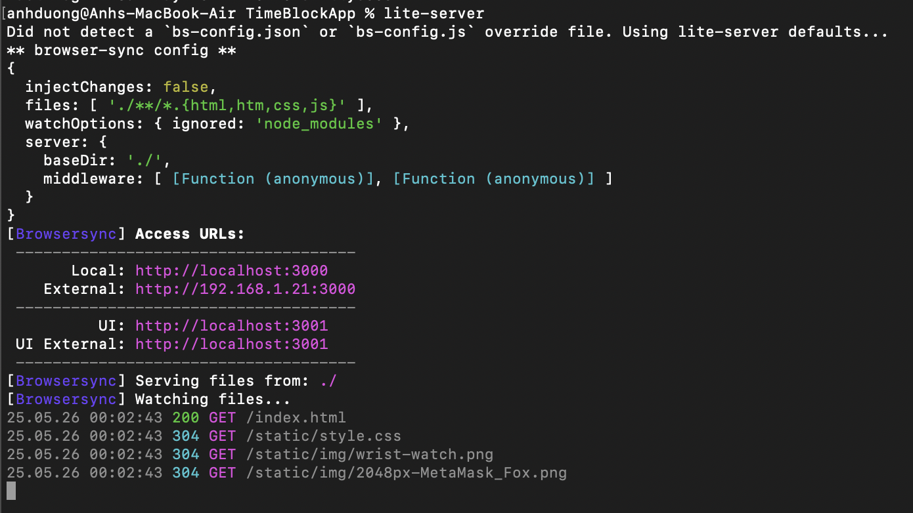

### Connect Wallet

* When you first access the web app you will be asked to connect your wallet
* To connect your wallet select the connect wallet button, you will be then prompt to sign in again to make the connection work.
* once logged in Switch the network to Sepolia if its already not selected by default already.  

## 8. Using the App

### Home page

 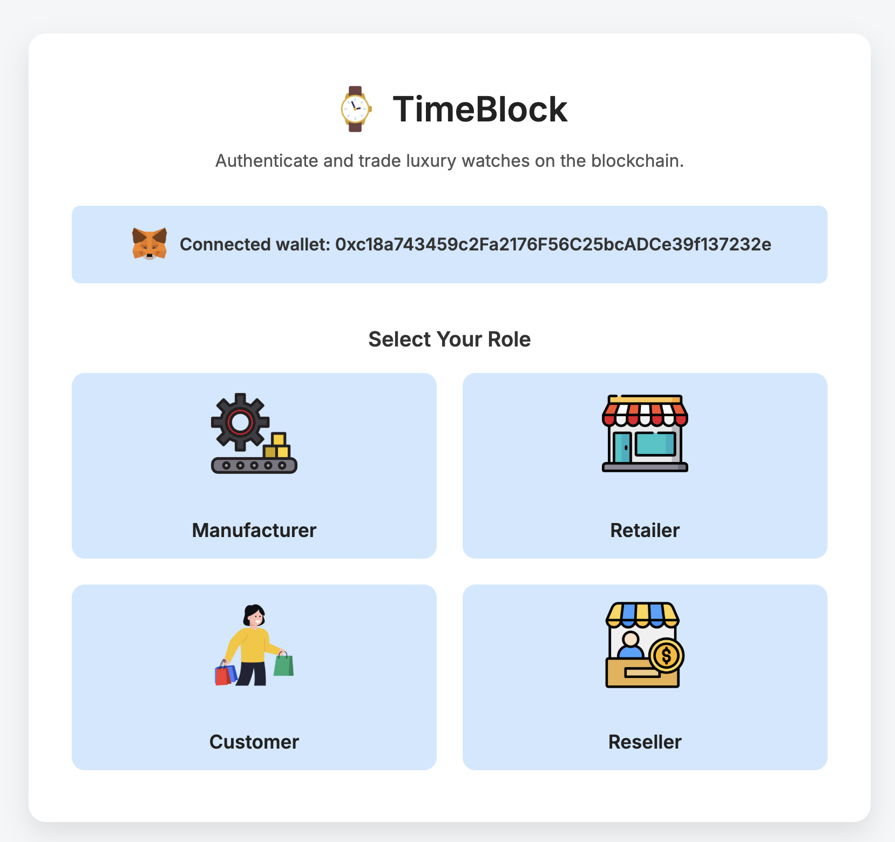

### Manufacturer Workflow

1. Register Watch: Fill serial, brand, date, model → Click 'Generate Certificate'

2. View Certificate: Select from dropdown → Click 'Show Certificate'

3. Assign to Retailer: Enter retailer address → Choose watch → Click 'Assign'

4. Transaction History: View assignment created

 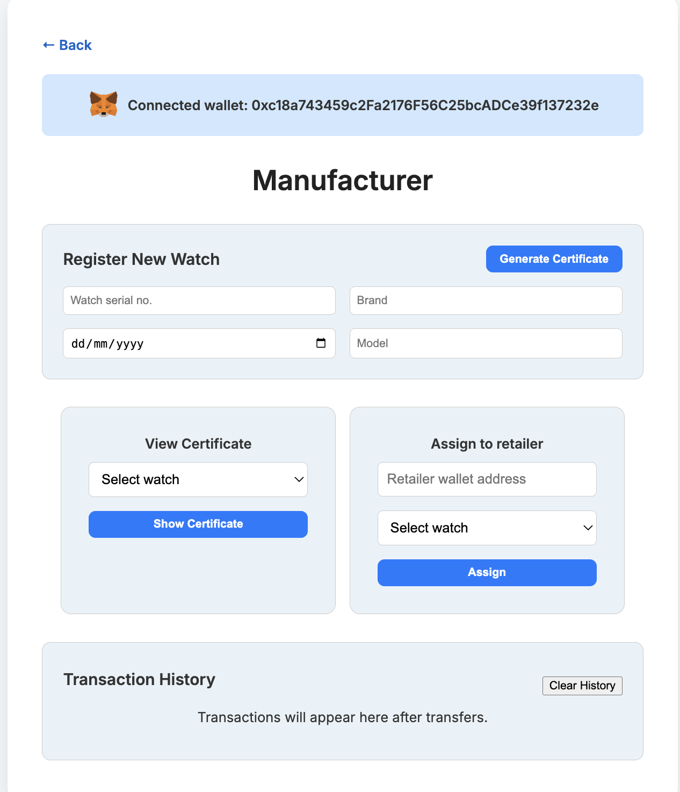

### Retailer Workflow
1. View Certificate: Select watch → Click 'Show Certificate'

2. List Watch: Set price in ETH → Click 'List for Sale'

3. View Listings: See all active listings made by retailer

4. Transaction History: View listings log and pricing

 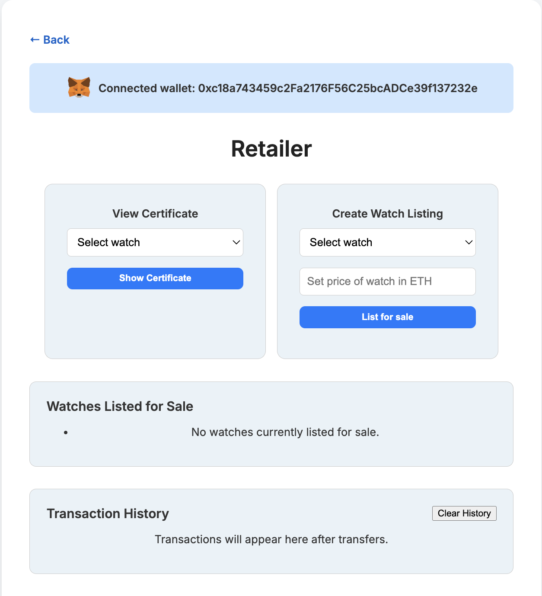

### Buyer Workflow 
#### Buy View:

1. See watches listed for sale by retailer. Only watches listed by verified retailers will appear here

2. Verify Certificate: Select a watch from the dropdown → Click 'View Certificate & Verify'

3. Buy from Retailer: Choose a listed watch → Click 'Buy Now' to deposit funds and trigger the ownership transfer

4. Transaction History: Logs all deposits

 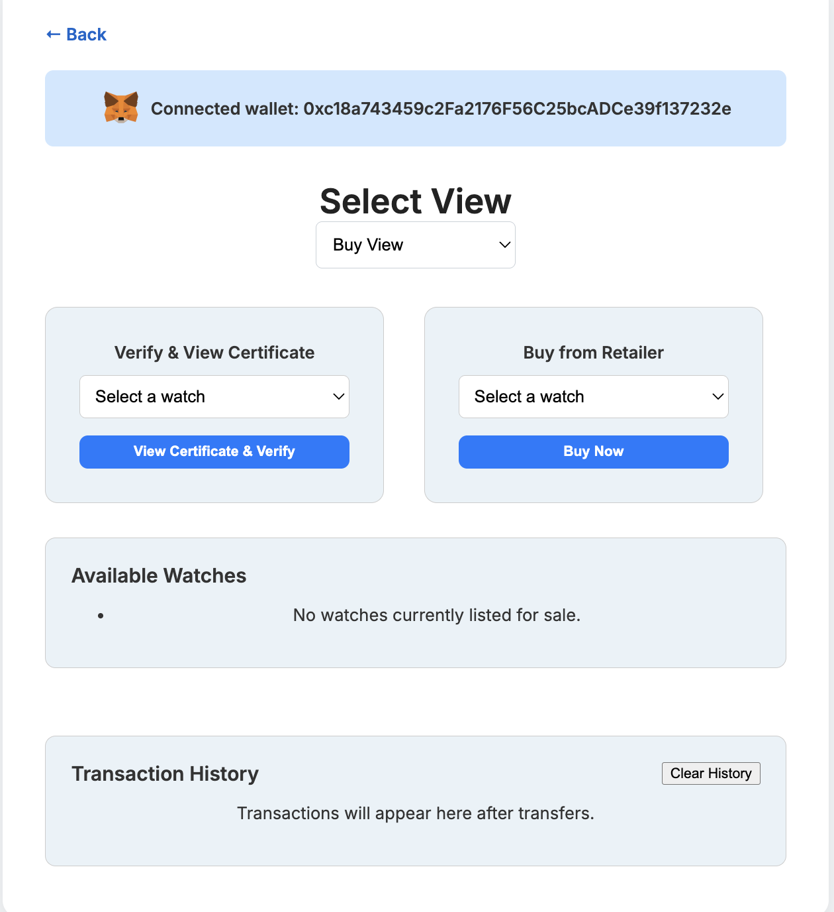

#### Sell View:

1. Verify Certificate: Choose one of your owned watches → Click 'View Certificate & Verify'

2. Create Watch Listing: Select your watch, input price in ETH → Click 'List for Sale'

3. Transaction History: View resale listing actions 

Only watches owned by the user and not currently listed will be selectable

 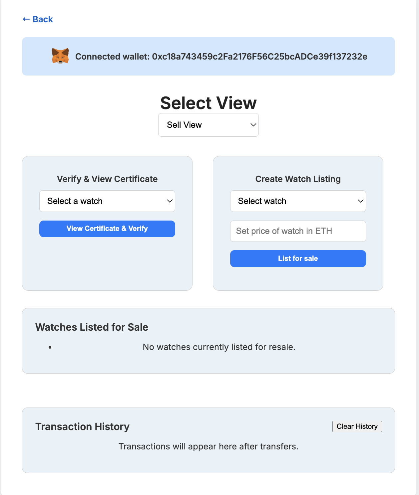

### Reseller Workflow

1. See watches listed for resale by customer

2.  Verify Certificate: Select from owned watches → Click 'View Certificate & Verify'

3. Buy from Customer: Select watch → Click 'Buy Now'

4. View History: Track all transfers and deposits

 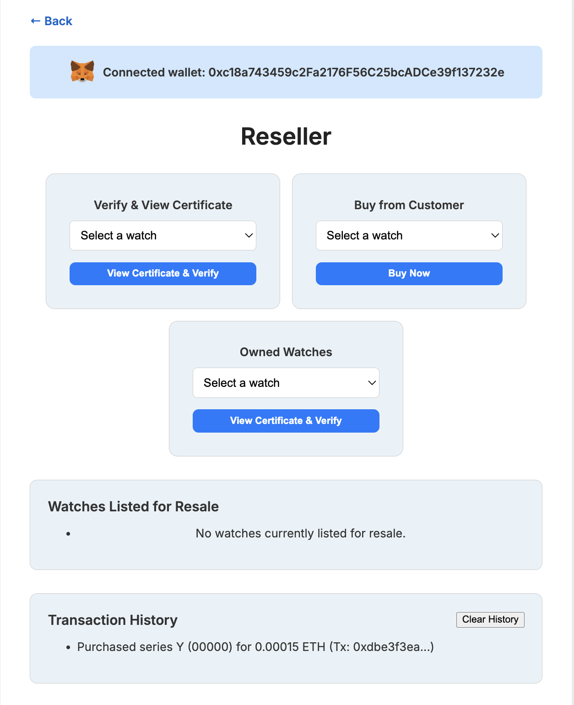

## 9. Troubleshooting

### server won't start:

    Check that lite-server is installed globally (npm install -g lite-server).
    Ensure that your in the correct directory (/TimeBlockApp) when starting the lite-server

### MetaMask isnt working:

* Ensure you are logged in

* Ensure Sepolia Test Network is selected

* Ensure wallet has test ETH


## 10. Future Improvements

1. Certificate lifecycle management improvement: this can be done by Implementing a system to revocation and renewal processes so that lost or compromised certificates can be invalidated or reissued securely.
2. Advanced analytics dashboard: This can be given to stakeholders to view more data about how their whatches are going through the process 
3. Imporve performance and gass by Utilising smart contract design patterns and explore meta-transactions or relayer networks to lower user costs per each transaction.
4. Implement an admin contract and admin role so stakeholders can only accessed their dashboards and functionalities.

## 11. License

MIT License.

## 12. Acknowledgements

* Ethereum docs
* Ethers.js library
* Remix IDE
* Testnet faucets
* Unit Coordinators, lecturers and tutors of the IFB452 course at QUT

## 12. Developers

* Ngoc Anh Duong Nguyen
* Jay Bowles 
* Oliver Gibson

